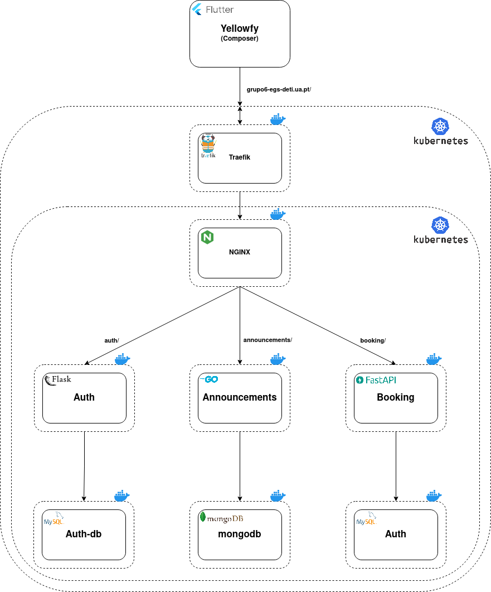

# yellowfy_egs

---
# Yellowfy
## Description
- Yellowfy app is an application with a lack of services behind where it's main purpose is to provide users an oppurtunity to search house work jobs and others and provide to others.
- **Architecture:** 


---
# Announcements API
## Description
- The announcements API will be responsible to manage the annoucements stored in the database and how they will interact with other services.
- Based on a REST API model, it will only handle requests and responses with JSON content.
- **Diagram:** 

## Documentation
- The REST API is in announcements/api/ directory, so any source code manipulation and operations must be in that same directory

## How to run
- Start and Run mongoDB container, by default mongoDB is on port 27017.
```bash
docker run -d --name mongodb -v $PWD/mongo/data:/data/db -p 27017:27017 mongo:latest
```

- Building api and getting go dependencies.
```go

// after getting the dependcies of go it will reconstruct go.mod to be more readable
go mod vendor
go mod tidy

// compiles the project into an executable
go build
```

- Starting the api
```go
./api
```
- To access the documentation of announcements API go to the browser and access http://localhost:9000/docs
---
---
